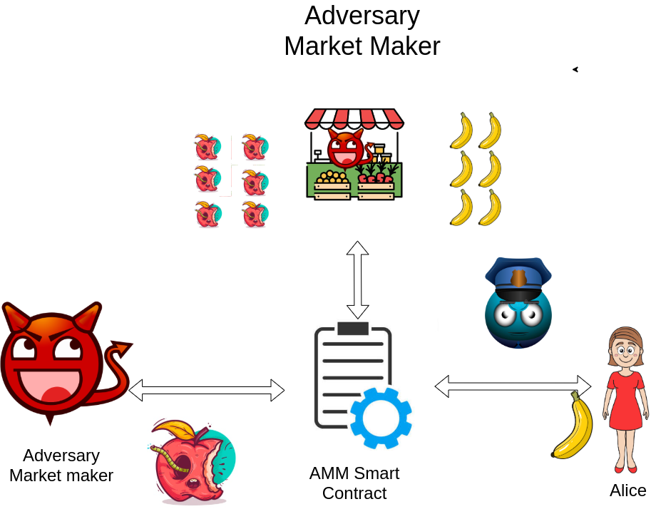
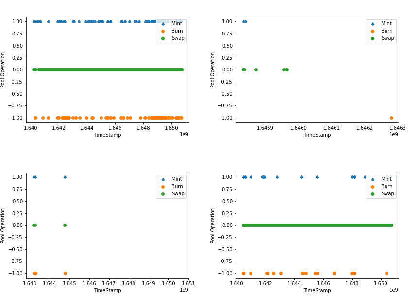
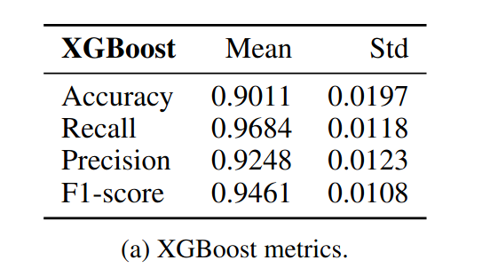

# PolygonRugPullETHGlobal

Uniswap, like other DEXs, has gained much attention this last year because it is a non-custodial and publicly verifiable exchange that allows users to trade digital assets without trusted third parties. However, its simplicity and lack of regulation also makes it easy to execute initial coin offering scams by listing non-valuable tokens. This method of performing scams is known as rug pull, a phenomenon that already existed in traditional finance but has become more relevant in DeFi.

In this repo you will find a follow up of the work done in [Do not rug on me](https://www.mdpi.com/2227-7390/10/6/949). 
The main purpose of this work in progress is to label and predict rug pulls on Uniswap V3 on any EVM compatible network.
Using the tools provided, you can download all the important data related to a token. Moreover, the model trained in this repo will allow users to protect themself from potential malicious and scam tokens!

# Objective

Label tokens as scams and prevent users from falling to honeypots and potential rug pulls. Give a tool to users and FrontEnds to whitelist and blacklist tokens on different DEXs.

# Data obtained in Polygon network

Distribution of Mint, Burn and Swap events on UniswapV3 pools. Two big and reputated tokens and two rug pulls. Can you guess which ones are rug pulls?

# ML
Rug pulls are profitable if their malicious act is done before they are discovered. Therefore, most rug pulls occur in the first 24 hours after the pool is created. This encourages us to build a tool to detect malicious tokens at startup. For each labelled token, we have computed its features at hour 24 after its pool creation. Then, we trained XGBoost with those features. In particular, we used a 5-Fold Cross Validation to evaluate the model performance.

# Results
Our model obtains an accuracy Accuracy of 0.9011, recall of 0.9684 and precision of 0.9248 and F1 of 0.9461 in distinguishing scams from non-malicious tokens. 

# Future work:

- Improve understanding of liquidity in Uniswap V3.
- Fuzz testing on Token smart contract.
- Generalize concepts as Gini coefficient in Uniswap V3 LP tokens.
- Simplify UX.

