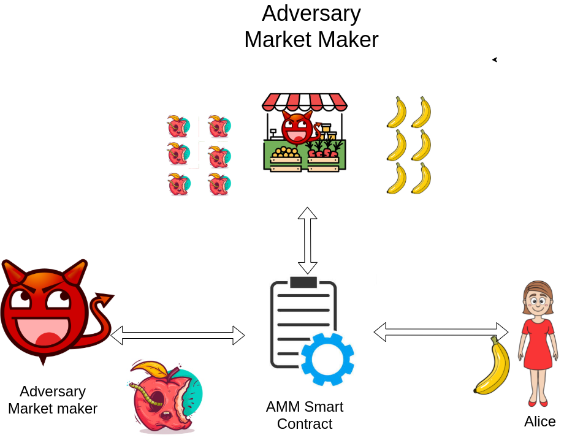

# PolygonRugPullETHGlobal

In this repo you will finda follow up of the work done in [Do not rug on me](https://www.mdpi.com/2227-7390/10/6/949). 
The main purpose of this work in progress is to label and predict rug pulls on Uniswap V3 on any EVM compatible network.
Using the tools provided, you can download all the important data related to a token. Moreover, the model trained in this repo will allow users to protect themself from potential malicious and scam tokens!

# Objective

Tagg tokens as scams and prevent users from falling to honeypots and potential rug pulls.

# Future work:

